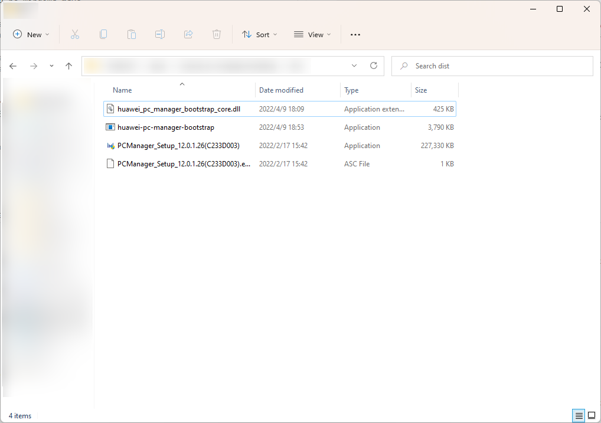
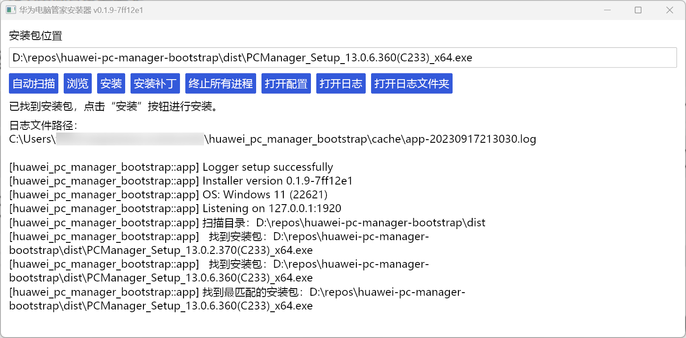

# 华为电脑管家安装包启动器

---

## Mentium

一个支持**微信操作电脑**（**多设备互通**，支持 **Weixin ClawBot**、微信公众号）、连接数据库、工作调研等工作、生活全能小助手(aka MentiumClaw 😂)。

前往下载：<https://mentium.app>，图形化界面，一键安装。发布：<https://x.com/hamflx/status/2036090507877834763>

典型使用案例：

1. 帮我分析一下生产数据库 token 使用量。
2. 每天 18:00 调研一下 Weixin ClawBot 对图片、视频、markdown 支持情况，并发送到我的微信。
3. 微信【关注公众号在公众号发送消息】：把桌面上的截图发给我。


---

该仓库用以解决华为电脑管家 V12 无法在非华为电脑上安装的问题。

## 使用方式

下载最新版本的安装器：<https://github.com/hamflx/huawei-pc-manager-bootstrap/releases>。

下载最新版本的华为电脑管家（目前测试支持的版本为：12.0.1.26(C233D003)），并将其解压，与安装器解压之后放置于同一个目录，如下图所示：



双击 `huawei-pc-manager-bootstrap.exe` 启动安装器（注意，启动安装器之后，将会请求管理员权限，因为华为电脑管家管家是需要管理员权限的）。

打开安装器之后，点击“自动扫描”按钮，安装器会查找所在目录的华为电脑管家安装包，如果找到安装包，会自动将安装包路径填写到上方的输入框中（如果未能自动找到安装包，应点击“浏览”按照选择安装包，或者手动输入绝对路径）。



点击“安装”按钮，安装器将启动安装包程序。**注意，安装过程中，安装器将会自动检测华为电脑管家的主程序是否已经安装完毕（即 `C:\Program Files\Huawei\PCManager\PCManager.exe` 该文件已经存在）。如果检测到该文件，则会自动释放补丁文件 `version.dll` 到该目录。**

## 从源码构建

需要 Windows x64、Visual Studio 2022 C++ 构建工具（含 x86/x64 MSVC 和 Windows SDK），以及 Rustup。项目固定使用 `nightly-2025-02-01`，与当前锁定依赖对应；不要直接使用滚动更新的 nightly 或 stable。

先安装构建脚本使用的两套宿主工具链（沿用项目的 x64/x86 分阶段构建流程；`forward-dll` 在 x64 补丁阶段生成对应导入库）：

```cmd
rustup toolchain install nightly-2025-02-01-x86_64-pc-windows-msvc --profile minimal
rustup toolchain install nightly-2025-02-01-i686-pc-windows-msvc --profile minimal --force-non-host
```

输入以下命令，所有命令都成功之后，会在项目下建立 `dist` 目录，保存构建成功的文件。

```cmd
git clone https://github.com/hamflx/huawei-pc-manager-bootstrap.git
cd huawei-pc-manager-bootstrap

.\build-release.bat
```

构建脚本先生成 x64 `version.dll`，再将其嵌入 x86 安装器，并构建 x86 注入核心。`dist` 中的 EXE 和核心 DLL 必须一起分发；无需额外分发已嵌入的补丁。开发构建使用 `build-dev.bat`。

运行不启动真实安装程序的回归测试：

```cmd
cargo +nightly-2025-02-01-i686-pc-windows-msvc test --locked --release -p huawei-pc-manager-bootstrap --target=i686-pc-windows-msvc
```

GitHub Actions 会针对 `master` 的 PR 构建、测试并检查 PE 架构，上传 `dist` 构建产物。CI 不验证 UAC 交互、真实华为安装包或设备协同功能；这些需在 Windows 测试机上验证。

## 自动发布版本

合并发布工作流后，推送 `vMAJOR.MINOR.PATCH` 标签（例如 `v0.1.12`）会自动运行完整 Windows 构建、回归测试、CLI 冒烟测试和 PE 架构检查。全部通过后，创建 GitHub Release，自动生成更新说明，并上传：

- `huawei-pc-manager-bootstrap-v0.1.12.zip`：包含必须一起使用的 x86 EXE 和核心 DLL；x64 `version.dll` 已嵌入 EXE
- `SHA256SUMS.txt`：ZIP 的 SHA-256 校验值

`v0.1.12-rc.1`、`v0.1.12-beta.1` 等带预发布后缀的标签会标为 Pre-release。标签严格采用上述版本格式（不支持 `+build`）；版本号由标签决定，工作流不会自动改写 Cargo.toml 中的 crate 版本。普通分支提交、PR 和手动运行工作流都只验证和上传 Actions 构建产物，不创建 Release。PR 也会实际执行 ZIP 打包与内容验证。

维护者确认要发布时，在含有发布工作流的提交上执行（下面只是操作示例，不是自动执行的命令）：

```sh
git switch master
git pull --ff-only
git tag -a v0.1.12 -m "Release v0.1.12"
git push origin v0.1.12
```

每个标签使用独立的执行队列。发布先创建草稿、上传完整附件，再公开；失败可在 Actions 中重新运行。重跑只修复同一提交创建的草稿，已成功发布的版本保持原附件不变，不覆盖手工创建的 Release。不要移动已发布的标签；修改内容应发布新版本。稳定版使用 GitHub 的版本排序规则选择 Latest，预发布不设为 Latest。

工作流使用 GitHub 自动提供的短期 `GITHUB_TOKEN`，只有发布任务拥有 `contents: write`，无需配置 PAT 或新密钥。若仓库/组织策略禁止写入 Release，需要管理员允许该工作流使用对应权限。可在 PowerShell 运行 `Get-FileHash .\huawei-pc-manager-bootstrap-v0.1.12.zip -Algorithm SHA256`，与校验文件中的值比较。

CI 不会调用真实华为安装程序，UAC、真实安装与设备协同仍需手动验证。发布逻辑的失败/重跑行为使用模拟 GitHub API 测试；首次真正推送版本标签后才会执行真实 Release 上传。

## 实现思路

1. 安装器启动安装包进行安装，在安装包执行 `"C:\Program Files\Huawei\PCManager\tmp\MBAInstallPre.exe" isSupportDevice` 和 `"C:\Program Files\Huawei\PCManager\tmp\MBAInstallPre.exe" IsSupportBaZhang` 时，结束该进程，并返回一个通过的值。
2. 上一步仅能保证能安装成功，但是在打开华为电脑管家时交互有些异常，以及一些联网功能无法使用。因此通过 `dll` 劫持让华为电脑管家加载自己开发的 `version.dll` 然后在该 `dll` 加载时，劫持 `GetSystemFirmwareTable` 函数，返回一个华为的型号即可。

## 相关资料整理

- 本文参考来源：

  - [[原创]非华为电脑安装华为电脑管家分析](https://bbs.pediy.com/thread-270682.htm)

- 其他安装工具 —— @汉客儿

  - [非华为电脑安装电脑管家最新版11多屏协同](https://www.hankeer.org/article/non-huawei-computer-install-pcmanager.html)
  - [魔法电脑：你们一直想要的开机启动](https://www.hankeer.org/article/magiccomputer_1.1.3.5.html)

- 其他安装工具 —— @空降猫咪

  - [【教程】非华为电脑管家安装教程（傻瓜式）](https://club.huawei.com/thread-30452752-1-1.html)

- 其他安装工具 —— @猫咪冰冰

  - `OpenCore` 魔改版（类似黑苹果，这就叫黑华为了），群内部资源，未在互联网上面找到公开的资料。

- 已知支持的网卡：

  | 英特尔 | 高通 | 备注 |
  | --- | --- | --- |
  | ax210 | | |
  | as201 | | |
  | ax200 | killer 1650x | |
  | ac9560 | | |
  | ac9462 | | |
  | ac9260 | killer 1550 | |
  | ac8265 | | |
  | AC3165 | | @丘之小透明：AC3165是可以的[捂脸]，本人联想y70002018款，就是那个超级终端只能在没连接的时候显示，一旦用超级终端连接后超级终端就消失了[捂脸] |
  | | | @小布尔乔亚之敌：小新pro14 intel版亲测可用 |

  来源：<https://zhuanlan.zhihu.com/p/387604394>
