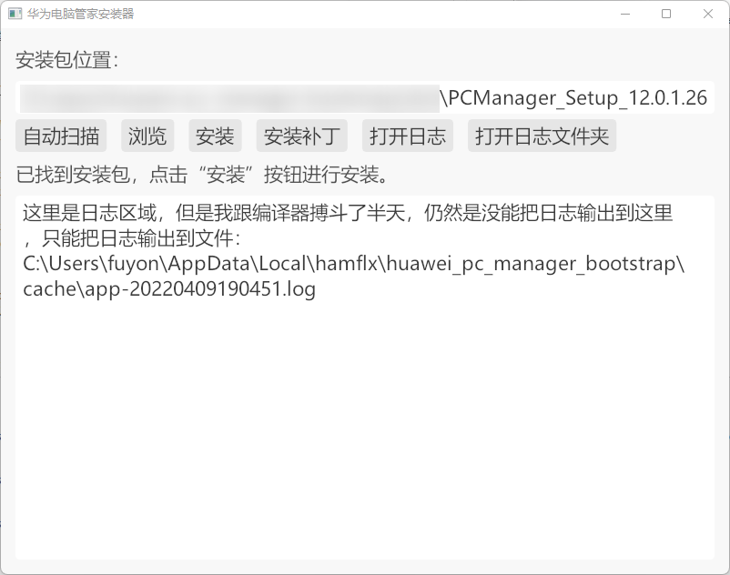

# 华为电脑管家安装包启动器

该仓库用以解决华为电脑管家 V12 无法在非华为电脑上安装的问题。

## 使用方式

下载最新版本的安装器：<https://github.com/hamflx/huawei-pc-manager-bootstrap/releases>。

下载最新版本的华为电脑管家（目前测试支持的版本为：12.0.1.26(C233D003)），并将其解压，与安装器解压之后放置于同一个目录，如下图所示：


双击 `huawei-pc-manager-bootstrap.exe` 启动安装器（注意，启动安装器之后，将会请求管理员权限，因为华为电脑管家管家是需要管理员权限的）。

打开安装器之后，点击“自动扫描”按钮，安装器会查找所在目录的华为电脑管家安装包，如果找到安装包，会自动将安装包路径填写到上方的输入框中（如果未能自动找到安装包，应点击“浏览”按照选择安装包，或者手动输入绝对路径）。



点击“安装”按钮，安装器将启动安装包程序。**注意，安装过程中，安装器将会自动检测华为电脑管家的主程序是否已经安装完毕（即 `C:\Program Files\Huawei\PCManager\PCManager.exe` 该文件已经存在）。如果检测到该文件，则会自动释放补丁文件 `version.dll` 到该目录。**

## 从源码构建

输入以下命令，所有命令都成功之后，会在项目下建立 `dist` 目录，保存构建成功的文件。

```cmd
git clone https://github.com/hamflx/huawei-pc-manager-bootstrap.git
cd huawei-pc-manager-bootstrap

.\build.bat
```

## 实现思路

1. 安装器启动安装包进行安装，在安装包执行 `"C:\Program Files\Huawei\PCManager\tmp\MBAInstallPre.exe" isSupportDevice` 和 `"C:\Program Files\Huawei\PCManager\tmp\MBAInstallPre.exe" IsSupportBaZhang` 时，结束该进程，并返回一个通过的值。
2. 上一步仅能保证能安装成功，但是在打开华为电脑管家时交互有些异常，以及一些联网功能无法使用。因此通过 `dll` 劫持让华为电脑管家加载自己开发的 `version.dll` 然后在该 `dll` 加载时，劫持 `GetSystemFirmwareTable` 函数，返回一个华为的型号即可。
